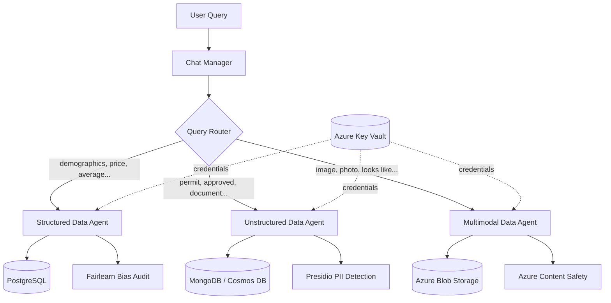

# Ethical Multi-Agent Data Orchestrator

A neighborhood insights assistant that answers natural-language questions by
routing them to one of three specialized agents — each backed by its own
Azure data store — and runs a domain-specific ethical safeguard before
returning an answer.

## What it does

Ask questions about five fictional neighborhoods (Ashford, Huntington,
Kingsley, Maplewood, Rosedale) covering demographics, housing, construction
permits, and house photos:

- *"Which demographic group has the most expensive homes?"*
- *"Was a permit approved for a restaurant in any of the neighborhoods?"*
- *"Find me a house like mine"*

A keyword-based router sends each question to the right agent. Every answer
is preceded by an automatic ethical check that runs against the *actual*
data used to generate that answer, not as a separate manual step.

## Architecture



See [`architecture.md`](./architecture.md) for a detailed breakdown of each
agent's mechanism and ethical check.

| Agent | Data source | Data type | Ethical check |
|---|---|---|---|
| **Structured** | Azure PostgreSQL Flexible Server | Demographics, house prices, schools, hospitals | Fairlearn bias audit across demographic columns |
| **Unstructured** | Azure Cosmos DB for MongoDB + Chroma (RAG) | Construction/renovation permit PDFs | Presidio PII detection on retrieved source documents |
| **Multimodal** | Azure Blob Storage | House exterior photos | Azure AI Content Safety scan on every compared image |

No agent has credentials to another agent's data source, and no data is
copied into a shared database — each store keeps custody of its own data.

## Prerequisites

- Python 3.11+
- An Azure subscription with the following resources provisioned:
  - Azure AI Foundry (chat + embedding model deployments)
  - Azure Database for PostgreSQL Flexible Server
  - Azure Cosmos DB for MongoDB
  - Azure Storage Account (Blob container named `houses`)
  - Azure AI Content Safety
  - Azure Key Vault (with your account granted access to secrets)

## Setup

1. **Install dependencies**

   ```bash
   pip install -r requirements.txt
   ```

2. **Configure Key Vault** (used by `chat.py`)

   Store the following secrets in your Key Vault, then set `keyVaultName`
   in `chat.py` to match:

   | Secret name | Value |
   |---|---|
   | `foundry-endpoint` | Azure OpenAI endpoint |
   | `foundry-api-key` | Azure OpenAI API key |
   | `postgres-host` / `postgres-user` / `postgres-dbname` / `postgres-password` | PostgreSQL connection details |
   | `cosmos-connection-string` / `cosmos-dbname` / `cosmos-collection` | Cosmos DB for MongoDB connection details |
   | `storage-connection-string` | Blob Storage connection string |
   | `safety-endpoint` / `safety-key` | Content Safety endpoint and key |

3. **Configure local environment** (used by the data-loading scripts only)

   Copy `.env.example` to `.env` and fill in your real values — `.env` is
   git-ignored and never committed.

   ```bash
   cp .env.example .env
   ```

4. **Load the data**

   ```bash
   python structured_load_azure.py     # loads CSVs into PostgreSQL
   python unstructured_load_azure.py   # extracts permit PDFs into MongoDB
   ```

   Upload the 12 images in `data/multimodal/` to the `houses` Blob
   container manually (or via the Azure CLI/Portal).

5. **Run the assistant**

   ```bash
   python chat.py
   ```

   You'll be prompted to authenticate via device code (Azure AD). Once
   loaded, ask questions at the `You:` prompt.

## Project structure

```
.
├── chat.py                      # Entry point — routing + chat loop
├── agents/
│   ├── structured_data_agent.py
│   ├── unstructured_data_agent.py
│   └── multimodal_data_agent.py
├── structured_load_azure.py     # One-time loader: CSVs -> PostgreSQL
├── unstructured_load_azure.py   # One-time loader: PDFs -> MongoDB
├── data/
│   ├── structured/               # Source CSVs
│   ├── unstructured/              # Source permit PDFs
│   └── multimodal/               # Source house images
├── architecture.md              # Detailed architecture writeup
├── evaluation_log.md            # Recorded test runs + ethical-check observations
├── .env.example                 # Template for local data-loading credentials
└── requirements.txt
```

## Security notes

- No credentials are hardcoded anywhere in this repository. `chat.py`
  pulls every secret from Azure Key Vault at runtime; the data-loading
  scripts read from a local, git-ignored `.env` file.
- If you fork or reuse this project, generate your own Azure resources and
  credentials — never commit a filled-in `.env` file or paste secret
  values into console-output logs that get committed.

## Cleanup

All Azure resources used for development were deleted after testing to
avoid ongoing costs. To reproduce this project, provision your own
resources following the Setup steps above.
