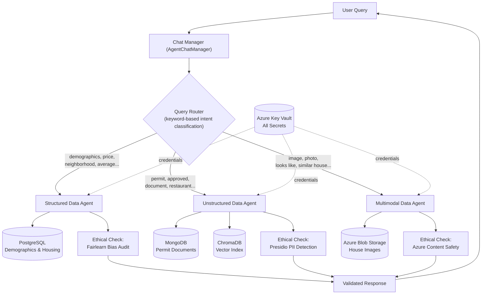

# Architecture: Ethical Multi-Agent Data Orchestrator

## Overview

This system answers natural-language questions about five (expandable to seven,
per the loaded permit data) neighborhoods by routing each query to one of three
specialized agents. Each agent owns a single data source, queries it in place,
and runs a domain-specific ethical check before the response is returned to the
user. No data is copied between systems and no data is centralized — the agents
are the only components with credentials to their respective stores, and those
credentials are pulled from Azure Key Vault at runtime rather than hardcoded.

## Diagram

## How It Works

1. **User submits a query** to the `AgentChatManager.chat()` entry point.
2. **The query router** (`_route_query`) performs keyword matching against three
   keyword lists (multimodal, unstructured, structured — checked in that
   priority order) and returns the name of the agent that should handle the
   request. If no keywords match, the router falls back to the unstructured
   agent.
3. **The selected agent executes**, querying its own data source directly:
   - The structured agent builds and runs SQL via a LangGraph ReAct agent
     wrapped around a LangChain `SQLDatabaseToolkit`.
   - The unstructured agent performs a similarity search against a Chroma
     vector index (built from MongoDB documents), retrieves the matching
     full documents from MongoDB, and generates a RAG answer with Azure
     OpenAI.
   - The multimodal agent iterates over every image in the Azure Blob
     `houses` container, computes CLIP embedding similarity against the
     query image, and returns the top-k matches.
4. **The ethical check runs inline**, as part of the same `ask()` /
   `find_similar()` call, not as a separate manual step:
   - Structured → Fairlearn bias audit
   - Unstructured → Presidio PII detection
   - Multimodal → Azure AI Content Safety
5. **The validated response is returned** to the user through the chat loop.

## Agent Roles

### Structured Data Agent (`agents/structured_data_agent.py`)
- **Data source:** Azure Database for PostgreSQL Flexible Server
- **Data type:** Demographic and housing records (house prices, school and
  hospital proximity data, education survey responses)
- **Mechanism:** Uses `SQLDatabase` + `SQLDatabaseToolkit` from LangChain to
  give a LangGraph `create_react_agent` direct, tool-mediated access to the
  database, so it can discover tables and write its own SQL rather than
  relying on a fixed schema.
- **Ethical check:** Before returning any answer, `__auto_bias_check` scans
  every table in the database, auto-detects likely demographic columns by
  keyword (race, ethnicity, gender, age, income, disability, etc.), and runs
  a Fairlearn fairness analysis against every other column in that table:
  - Binary columns → `MetricFrame` selection rate + demographic parity
    difference (flagged if > 0.10)
  - Numeric columns → group means and a min/max ratio (flagged if < 0.80)
  - Small categorical columns (2–10 unique values) → cross-tabulated
    percentage distribution by group
  This surfaces disparities (e.g., in home price or amenity access across
  demographic groups) directly in the console output alongside the answer.

### Unstructured Data Agent (`agents/unstructured_data_agent.py`)
- **Data source:** MongoDB (Cosmos DB for MongoDB), collection of permit PDFs
  that have already been text-extracted and stored as documents
- **Data type:** Construction/renovation permit records for pools, schools,
  restaurants, retail, and mixed-use developments across the neighborhoods
- **Mechanism:** A RAG pipeline — documents are embedded with
  `AzureOpenAIEmbeddings` and indexed in a local Chroma vector store
  (`build_index`). At query time, `ask()` runs a similarity search, pulls the
  full source document back out of MongoDB by its `ObjectId` (never
  operating on embeddings alone), assembles a context prompt, and generates
  an answer with `AzureChatOpenAI`.
- **Ethical check:** `__contains_pii` runs a Presidio `AnalyzerEngine` pass
  over the *source documents* used to answer the query (not the embeddings),
  logging each unique detected entity type and confidence score (URLs and
  low-confidence hits are filtered out). Because the permit documents contain
  real-looking owner names, phone numbers, and email addresses, this check
  reliably surfaces PERSON, PHONE_NUMBER, and EMAIL_ADDRESS entities before
  the answer is shown.

### Multimodal Data Agent (`agents/multimodal_data_agent.py`)
- **Data source:** Azure Blob Storage container `houses`
- **Data type:** Exterior photographs of houses across the neighborhoods
- **Mechanism:** Uses a pretrained CLIP model (`openai/clip-vit-base-patch32`)
  to embed both the user's query image and every blob image, normalizes the
  embeddings, and computes cosine similarity. `find_similar()` returns the
  top-k most visually similar houses along with the query image for display.
- **Ethical check:** Every blob image is passed through Azure AI Content
  Safety's `analyze_image` before it is used in the comparison
  (`__load_image_from_blob`). Category/severity scores are logged for each
  image, and any non-zero severity is flagged as a warning in the console
  output — so unsafe or unexpected content in the image store is caught as
  part of normal query processing, not as a separate audit step.

## Chat Manager (`chat.py`)

`AgentChatManager` is the single entry point:
- `_load_agents()` authenticates to Azure Key Vault via `DeviceCodeCredential`
  and retrieves every secret (PostgreSQL, MongoDB, Blob Storage, Azure OpenAI,
  and Content Safety credentials) before constructing the three agents — no
  secret is ever hardcoded in source.
- `_route_query()` classifies intent via keyword matching, checked in
  multimodal → unstructured → structured priority order, with unstructured as
  the default fallback.
- `_run_structured` / `_run_unstructured` / `_run_multimodal` wrap each
  agent's public method and normalize the return shape to a plain string.
- `chat()` ties routing and dispatch together and wraps execution in a
  try/except so a failure in one agent doesn't crash the whole session.

## Data Sovereignty

Each data owner keeps custody of their own store. No agent has credentials to
another agent's data source, no record-level data is copied into a shared
database, and the only durable artifact the assistant creates locally is the
Chroma vector index (embeddings only, not the source documents themselves)
used to accelerate permit-document retrieval.
